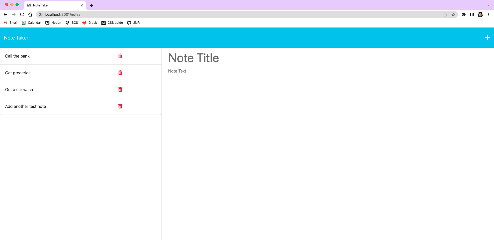

# Note Taker

  ## Table Of Contents

  * [Description](#description)
  * [Installation](#installation)
  * [Usage](#usage)
  * [Contributing](#credits)
  * [Tests](#test)
  * [Questions](#questions)
   
  ## Desciption

  As part of Challenge 11, this uses Express JS to link 2 HTMLs together into a notetaker application.

  Deployed App: https://elaine0919-note-taker.herokuapp.com/

  Demo: https://drive.google.com/file/d/1FwfhRJj6fBq2IoxhKPrw8csX54GoorIp/view?usp=share_link
  
  Screenshot: 
  

  ## Installation

  In order to use the application: 
  (1) ensure that node and npm are installed 
  (2) clone the repository and save in your local 
  (3) install dependencies by using code npm install

  ## Usage

  To run the script in the terminal, use code npm start

  ## Contributing

  Starter code cloned from https://github.com/coding-boot-camp/miniature-eureka

  ## Tests

  N/A

  ## Questions

  For any questions about the project, please reach out to the information below:
  > Email: elaine.bautista@gmail.com
  > GitHub: elaine0919

